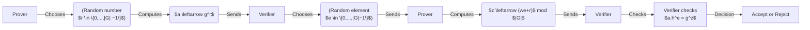

# zkp-implementation

```mermaid
flowchart LR
    A[Prover] -- Chooses --> B("(Random number<br/>$r \in \{0,...,|G| −1\}$)")
    B -- Computes --> C($a \leftarrow g^r$)
    C -- Sends --> D[Verifier]
    D -- Chooses --> E("(Random element<br/>$e \in \{0,...,|G|−1\}$)")
    E -- Sends --> F[Prover]
    F -- Computes --> G("$z \leftarrow (we+r)$ mod $|G|$")
    G -- Sends --> H[Verifier]
    H -- Checks --> I[Verifier checks<br/>$a.h^e = g^z$]
    I -- Decision --> J[Accept or Reject]
```